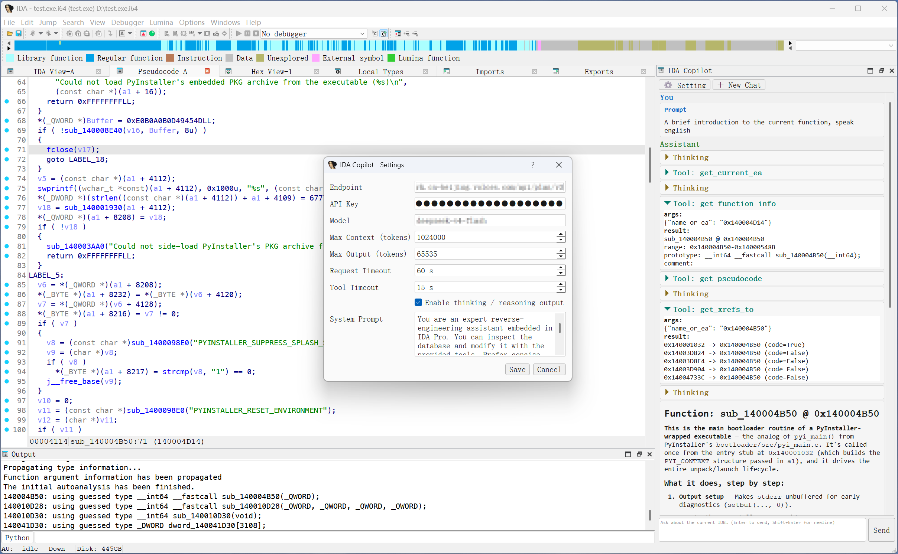

<div align="center">

# 🤖 IDA Copilot

**An AI assistant for IDA Pro 9.x** — chat with an LLM inside IDA and let it
inspect, decompile, rename, retype and comment your binaries for you.

Powered by **Pydantic AI** · **OpenAI-compatible** endpoints · **Qt** chat UI

**[English](README.md)** · **[中文](README_zh.md)**

</div>

---

## ✨ Features

- 🪟 **Dockable chat window** — opens with `Ctrl+Shift+C` or `Edit > Plugins > IDA Copilot`, docks to the right of the workspace.
- 🧠 **Pydantic AI agent** — a real agent loop with streaming, tool calling and thinking support.
- 🔧 **30+ IDA tools** — the agent can read and modify the database: pseudocode, disassembly, xrefs, strings, segments, renaming, retyping, structs/enums, comments, and more.
- ⚡ **Streaming output** — tokens appear as they are generated, rendered as Markdown (tables, code blocks, lists…).
- 💭 **Thinking & tool-call blocks** — collapsible cards, collapsed by default, expandable anytime.
- 🛠️ **`run_idapython`** — the model can execute IDAPython snippets against the live database (sandboxed: IDA modules + Python stdlib only).
- 🔌 **Any OpenAI-compatible endpoint** — OpenAI, DeepSeek, Qwen/DashScope, Ollama, vLLM, etc.
- ⏱️ **Configurable timeouts** — request and tool-execution timeouts.
- 🧵 **Non-blocking** — the agent runs on a background worker thread; IDA's UI never freezes.

## 🖼️ Screenshots



## 📋 Requirements

- **IDA Pro 9.x** (GUI, 64-bit)
- IDA's embedded **Python 3.12** (or a Python 3.10+ interpreter selected via `idapyswitch`)
- Python packages: see [requirements.txt](requirements.txt)

## 🚀 Quick Start

```bash
# 1) Install the Python dependencies into the interpreter IDA uses
python -m pip install -r requirements.txt

# 2) Copy / symlink this folder into your IDA plugins directory
#    Windows:  %APPDATA%\Hex-Rays\IDA Pro\plugins\ida_copilot
#    macOS/Linux: ~/.idapro/plugins/ida_copilot
#    (or drop it into IDA's own <ida>/plugins/ directory)

# 3) Restart IDA
```

## 🎮 Usage

1. Open the chat window: press **`Ctrl+Shift+C`** (or `Edit > Plugins > IDA Copilot`).
2. Click **⚙ Setting**, fill in your **Endpoint**, **API Key** and **Model**, then **Save**.
3. Ask away — for example:

   > What does `sub_401000` do? Rename its local variables to something meaningful and add comments at each call site.

The agent will stream its answer and, where useful, call IDA tools that you can
expand to inspect.

## ⚙️ Configuration

Settings are persisted to a local JSON file:

| Field | Description |
|-------|-------------|
| **Endpoint** | OpenAI-compatible base URL, e.g. `https://api.openai.com/v1` |
| **API Key** | Secret key (stored locally, never sent anywhere else) |
| **Model** | Model name, e.g. `gpt-4o`, `deepseek-chat`, `qwen-plus` |
| **Max Context** | Soft cap on input tokens |
| **Max Output** | `max_tokens` for completions |
| **Request Timeout** | Timeout (s) for model API requests |
| **Tool Timeout** | Timeout (s) for tool execution |
| **Thinking** | Enable reasoning output where supported |
| **System Prompt** | Optional custom system prompt |

Config file locations:

- Windows: `%APPDATA%\Hex-Rays\IDA Pro\ida_copilot.json`
- macOS / Linux: `~/.idapro/ida_copilot.json`

Environment variables are used as defaults: `OPENAI_BASE_URL`, `OPENAI_API_KEY`, `OPENAI_MODEL`.

## 🧰 Agent Tools

The agent can call any of these tools:

**Read / inspect**

`get_ea_by_name` · `get_name_at_ea` · `get_current_ea` · `get_function_list` ·
`get_segments` · `get_strings` · `get_xrefs_to` · `get_xrefs_from` ·
`get_function_info` · `get_disassembly` · `get_function_disassembly` ·
`get_pseudocode` · `get_data_info` · `get_type_info` · `get_comments` ·
`list_local_types`

**Write / edit**

`set_name` · `set_comment` · `set_function_comment` · `set_function_prototype` ·
`set_type_at_ea` · `set_variable_name` · `set_variable_type` · `create_struct` ·
`create_enum` · `add_struct_member` · `rename_struct_member` ·
`del_struct_member` · `apply_struct_type`

**Execute**

`run_idapython` — runs IDAPython code against the database (sandboxed).

## 🛡️ Safety

- `run_idapython` only allows **IDA modules + Python stdlib**; host modules
  (`os`, `sys`, `subprocess`, `socket`, `pathlib`, `ctypes`, `requests`, …) are
  blocked so the model cannot escape to the host OS.
- Timeouts protect against runaway requests and long-running tool calls.

## ❓ FAQ

<details>
<summary>Which models work?</summary>

Any **OpenAI-compatible** chat model: OpenAI, DeepSeek, Qwen/DashScope,
Ollama (local), vLLM, Groq, Mistral, etc. Point the Endpoint at its
`/v1` base URL.

</details>

<details>
<summary>Does it need Hex-Rays / the decompiler?</summary>

No. Pseudocode tools return a clear message when the decompiler is unavailable;
all other tools still work.

</details>

<details>
<summary>Is my API key stored safely?</summary>

It is stored in plaintext in a local JSON config file (never sent anywhere
other than your configured endpoint). Treat the file like you would any local
secret.

</details>

## 📁 Project Layout

```
ida_copilot/
├── ida-plugin.json      ← IDA 9.x directory-plugin manifest
├── requirements.txt     ← Python dependencies
├── main.py              ← plugin entry point (hotkey, menu, docking)
└── ida_copilot/
    ├── config.py        ← settings model + JSON persistence
    ├── tools.py         ← IDA tools exposed to the agent
    ├── agent.py         ← Pydantic AI agent + streaming worker
    └── ui.py            ← Qt chat window + settings dialog
```

## 🤝 Contributing

Contributions, issues and feature requests are welcome. Feel free to open a
pull request or an issue.

## 📄 License

Distributed under the [Apache License 2.0](LICENSE).

---

**[中文文档](README_zh.md)**
